# 🎨 Direct Diagram Generation Prompts

Copy and paste these prompts into AI-powered diagram tools or use the code snippets below.

---

## 🤖 **AI PROMPT FOR USE CASE DIAGRAM**

Copy this entire prompt into ChatGPT, Claude, or any AI diagram generator:

```
Create a UML Use Case Diagram for "MediCore Medical Report Analyzer System" with the following specifications:

ACTORS (draw as stick figures):
1. User (Public User) - on the left side
2. AI Assistant - on the right side
3. OCR Service (Python) - bottom left
4. LLM (Ollama) - bottom right
5. PDF Parser - bottom center

SYSTEM BOUNDARY:
- Draw a large rectangle labeled "MediCore System"

USE CASES (draw as ovals inside the system boundary):
1. Upload Report (PDF or Image)
2. Extract Text from Image (OCR)
3. Extract Text from PDF
4. Analyze Medical Report
5. Translate Medical Text
6. Chat with AI Assistant
7. Generate Simplified Summary
8. Extract Parameters
9. Generate Treatment Recommendations
10. Display Analysis Results

CONNECTIONS:
- User connects to: Upload Report, Analyze Medical Report, Translate Medical Text, Chat with AI Assistant, Display Analysis Results
- OCR Service connects to: Extract Text from Image (arrow FROM OCR Service TO use case)
- PDF Parser connects to: Extract Text from PDF (arrow FROM PDF Parser TO use case)
- AI Assistant connects to: Generate Simplified Summary (arrow FROM use case TO AI Assistant), Generate Treatment Recommendations (arrow FROM use case TO AI Assistant)
- LLM connects to: Generate Simplified Summary (arrow FROM use case TO LLM), Generate Treatment Recommendations (arrow FROM use case TO LLM)

DEPENDENCIES (dashed arrows with <<include>>):
- Analyze Medical Report <<include>> Extract Text from Image OR Extract Text from PDF
- Analyze Medical Report <<include>> Extract Parameters
- Analyze Medical Report <<include>> Generate Simplified Summary

Use standard UML notation. Make it clean and professional.
```

---

## 🤖 **AI PROMPT FOR CLASS DIAGRAM**

Copy this entire prompt into ChatGPT, Claude, or any AI diagram generator:

```
Create a UML Class Diagram for "MediCore Medical Report Analyzer System" with the following classes and relationships:

CLASSES:

1. User
   Attributes: userId: String, name: String, email: String, language: String
   Methods: login(), logout()

2. Report
   Attributes: reportId: String, fileName: String, fileType: String, fileSize: Number, uploadedAt: Date, extractedText: String
   Methods: upload(), validate(), getFileType()

3. Analysis
   Attributes: analysisId: String, reportId: String, simplifiedSummary: String, detailedExplanation: String, keyFindings: Array, treatmentRecommendations: Array, medicineSuggestions: Array, lifestyleAdvice: Array, whenToConsultDoctor: Array, parameterBreakdown: Array, createdAt: Date
   Methods: generateSummary(), extractParameters(), formatResults()

4. Parameter
   Attributes: parameterId: String, parameterName: String, patientValue: String, normalRange: String, unit: String, status: String, explanation: String
   Methods: detectStatus(), generateExplanation()

5. OCRService
   Attributes: serviceId: String, pythonPath: String
   Methods: extractFromImage(), extractFromPDF(), validateImage()

6. AIService
   Attributes: serviceId: String, provider: String, modelName: String
   Methods: analyzeReport(), simplifyText(), generateRecommendations(), tryOllama(), tryHuggingFace(), tryDictionary()

7. LLM
   Attributes: modelName: String, baseUrl: String
   Methods: generateResponse(), checkAvailability()

8. TranslatorService
   Attributes: sourceLanguage: String, targetLanguage: String
   Methods: translate(), simplifyText()

9. ChatbotService
   Attributes: conversationId: String, history: Array
   Methods: processQuestion(), addToHistory(), clearHistory()

RELATIONSHIPS:
- User → Report (1 to 0..*): "uploads" (association)
- Report → Analysis (1 to 1): "generates" (composition - filled diamond)
- Analysis → Parameter (1 to 0..*): "contains" (composition - filled diamond)
- Report → OCRService: "uses" (dependency - dashed arrow)
- Analysis → AIService: "uses" (dependency - dashed arrow)
- AIService → LLM: "uses" (dependency - dashed arrow)
- User → TranslatorService (1 to 1): "uses" (association)
- User → ChatbotService (1 to 1): "uses" (association)
- TranslatorService → AIService: "uses" (dependency - dashed arrow)
- ChatbotService → AIService: "uses" (dependency - dashed arrow)

Show all multiplicities. Use standard UML notation with proper arrow types.
```

---

## 📝 **PLANTUML CODE (Copy-Paste Ready)**

### **Use Case Diagram - PlantUML**

Copy this code into https://plantuml.com/ or any PlantUML editor:

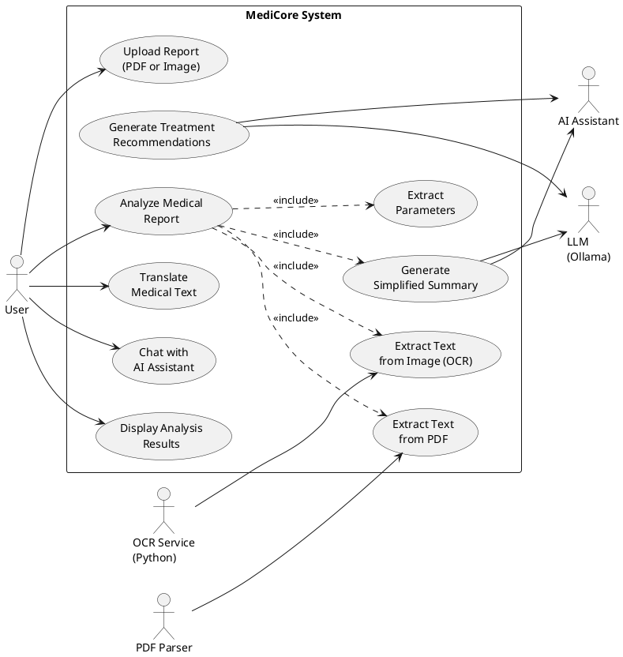

### **Class Diagram - PlantUML**

Copy this code into https://plantuml.com/ or any PlantUML editor:

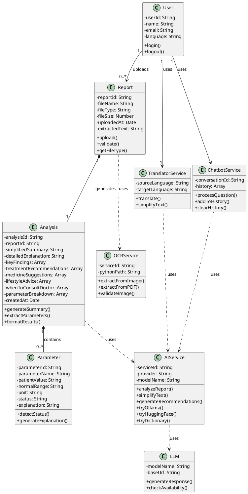

---

## 🌊 **MERMAID CODE (Copy-Paste Ready)**

### **Use Case Diagram - Mermaid**

Copy this code into https://mermaid.live/ or any Mermaid editor:

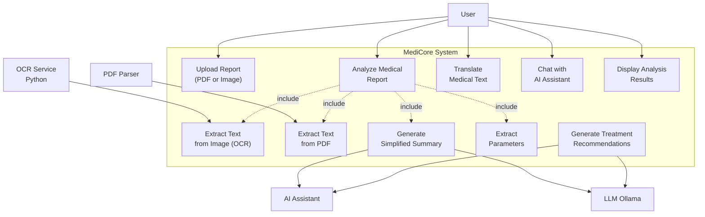

### **Class Diagram - Mermaid**

Copy this code into https://mermaid.live/ or any Mermaid editor:

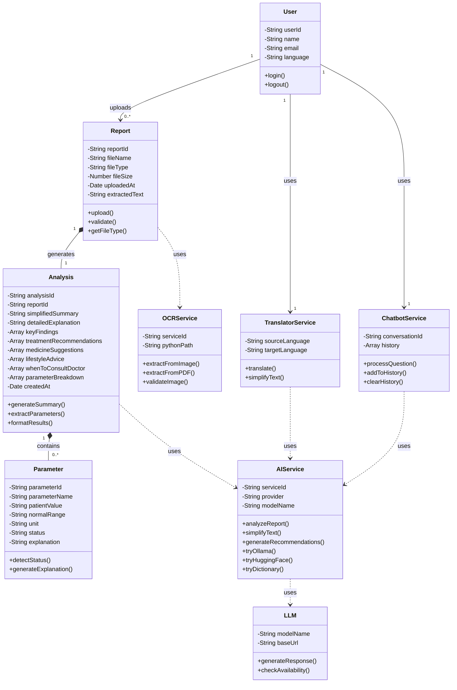

---

## 🚀 **QUICK START GUIDE**

### **Option 1: AI Tools (ChatGPT, Claude, etc.)**
1. Copy the **AI PROMPT** sections above
2. Paste into ChatGPT/Claude
3. Ask: "Create a visual diagram based on this specification"
4. Download the generated diagram

### **Option 2: PlantUML (Recommended)**
1. Go to https://plantuml.com/start
2. Copy the **PlantUML code** above
3. Paste into the editor
4. Click "Submit" or "Generate"
5. Download as PNG/SVG

### **Option 3: Mermaid**
1. Go to https://mermaid.live/
2. Copy the **Mermaid code** above
3. Paste into the editor
4. Download as PNG/SVG

### **Option 4: Draw.io (Manual but Easy)**
1. Go to https://app.diagrams.net/
2. Use the AI prompts as a checklist
3. Drag and drop elements
4. Connect them following the relationships

---

## 📋 **ONE-LINER PROMPTS FOR AI**

### **Use Case Diagram:**
```
Create a UML Use Case Diagram for MediCore Medical Report Analyzer with actors: User, AI Assistant, OCR Service, LLM, PDF Parser. Use cases: Upload Report, Extract Text (OCR/PDF), Analyze Report, Translate Text, Chat, Generate Summary, Extract Parameters, Generate Recommendations, Display Results. User connects to main use cases. Services connect to extraction use cases. AI connects to generation use cases. Include dependencies between Analyze Report and other use cases.
```

### **Class Diagram:**
```
Create a UML Class Diagram for MediCore with classes: User (userId, name, email, language), Report (reportId, fileName, extractedText), Analysis (analysisId, simplifiedSummary, keyFindings, parameterBreakdown), Parameter (parameterName, patientValue, status), OCRService, AIService, LLM, TranslatorService, ChatbotService. Relationships: User uploads Report (1 to many), Report generates Analysis (1 to 1 composition), Analysis contains Parameter (1 to many composition), Report uses OCRService, Analysis uses AIService, AIService uses LLM. Show all multiplicities and use proper UML notation.
```

---

## ✅ **RECOMMENDED TOOL ORDER**

1. **PlantUML** - Best for code-based generation, most accurate
2. **Mermaid** - Good for quick diagrams, easy to edit
3. **AI Tools** - Good for initial draft, may need refinement
4. **Draw.io** - Best for manual control and customization

**Try PlantUML first - it's the fastest and most accurate! 🚀**

---

## 🔄 **SEQUENCE DIAGRAM CODE**

### **Sequence Diagram - PlantUML (Report Analysis Flow)**

Copy this code into https://plantuml.com/:

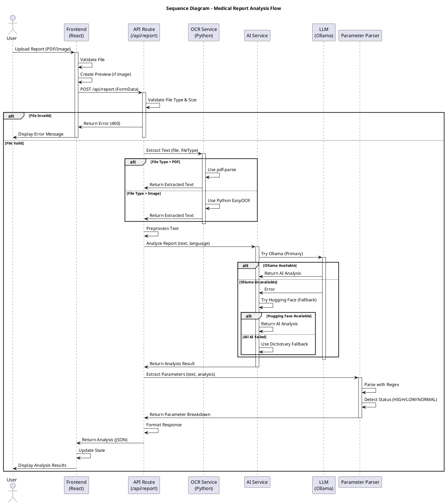

### **Sequence Diagram - PlantUML (Translate Text Flow)**

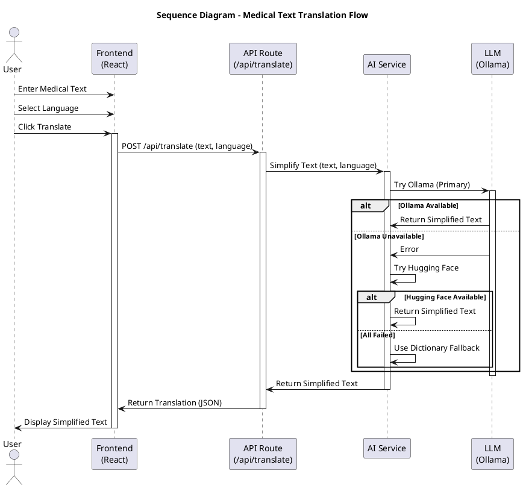

### **Sequence Diagram - PlantUML (Chatbot Flow)**

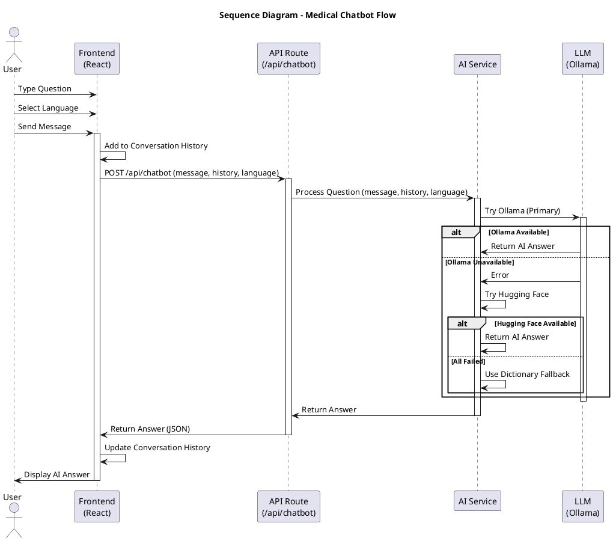

### **Sequence Diagram - Mermaid**

Copy this code into https://mermaid.live/:

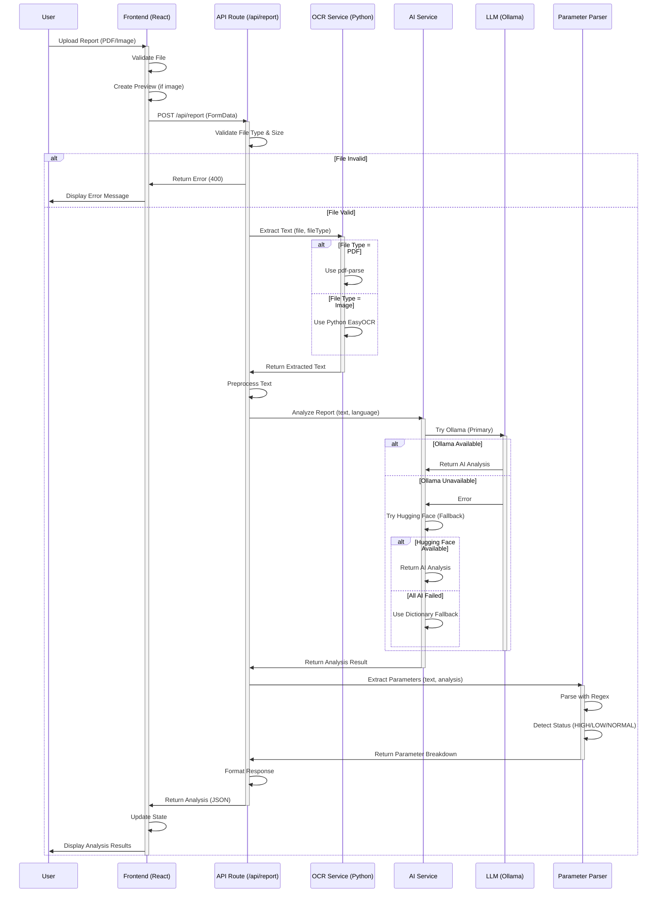

---

## 🎯 **ACTIVITY DIAGRAM CODE**

### **Activity Diagram - PlantUML (Report Analyzer Workflow)**

Copy this code into https://plantuml.com/:

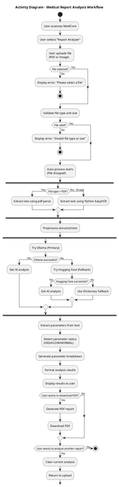

### **Activity Diagram - PlantUML (Multi-Feature Workflow)**

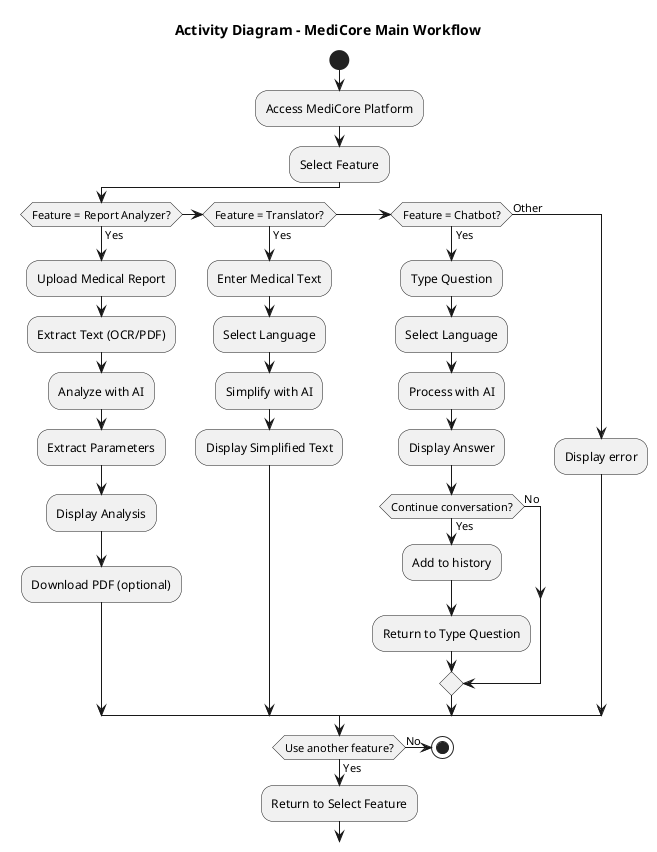

### **Activity Diagram - Mermaid**

Copy this code into https://mermaid.live/:

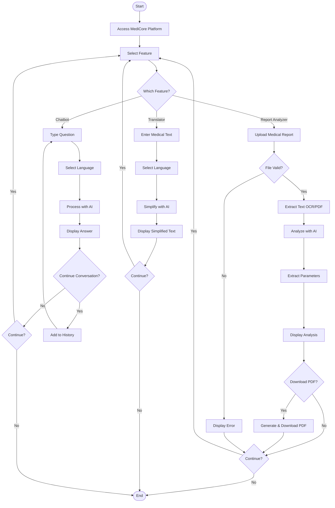

### **Activity Diagram - PlantUML (Swimlanes Version)**

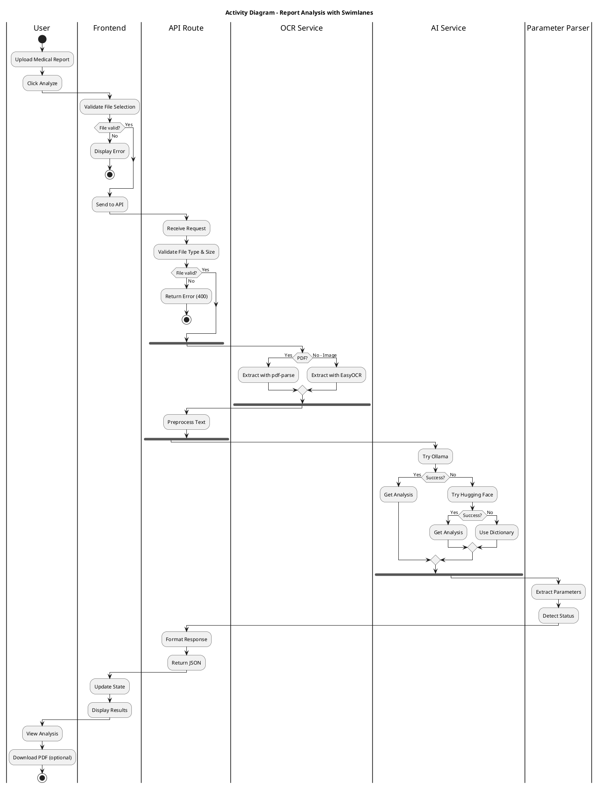

---

## 🤖 **AI PROMPTS FOR SEQUENCE & ACTIVITY DIAGRAMS**

### **Sequence Diagram Prompt:**

```
Create a UML Sequence Diagram for "MediCore Medical Report Analyzer" showing the interaction flow:

Participants (from left to right):
- User (actor)
- Frontend (React)
- API Route (/api/report)
- OCR Service (Python)
- AI Service
- LLM (Ollama)
- Parameter Parser

Flow:
1. User uploads report to Frontend
2. Frontend validates and sends to API
3. API validates file and calls OCR Service
4. OCR extracts text (PDF or Image path)
5. API preprocesses text and calls AI Service
6. AI Service tries Ollama (primary), falls back to Hugging Face, then Dictionary
7. AI returns analysis to API
8. API calls Parameter Parser to extract parameters
9. Parser returns breakdown to API
10. API formats and returns to Frontend
11. Frontend displays results to User

Show activation boxes, alt blocks for conditions, and proper message arrows.
```

### **Activity Diagram Prompt:**

```
Create a UML Activity Diagram for "MediCore Medical Report Analysis Workflow" with:

Start: User accesses MediCore
Activities: Upload file, Validate file, Extract text (fork: PDF or Image), Preprocess text, Analyze with AI (fork: Ollama/HuggingFace/Dictionary), Extract parameters, Display results, Download PDF (optional)

Decision nodes:
- File selected? (No → Error, Yes → Continue)
- File valid? (No → Error, Yes → Continue)
- File type? (PDF → pdf-parse, Image → EasyOCR)
- AI successful? (Yes → Use result, No → Try fallback)
- Download PDF? (Yes → Generate, No → Skip)
- Continue? (Yes → Return to start, No → End)

Use fork/join for parallel processes. Show all paths clearly.
```

---

## ✅ **QUICK REFERENCE**

### **Sequence Diagram:**
- Shows **interactions over time**
- Participants are vertical lines
- Messages are horizontal arrows
- Activation boxes show active periods
- Use **alt/else** for conditions

### **Activity Diagram:**
- Shows **workflow/process flow**
- Activities are rounded rectangles
- Decisions are diamonds
- Fork/Join for parallel processes
- Start (circle) and End (double circle)

**All code is ready to copy-paste! 🚀**

---

## 🔄 **SEQUENCEDIAGRAM.ORG CODE (Text-Based Syntax)**

### **Sequence Diagram - SequenceDiagram.org (Report Analysis Flow)**

Copy this code into https://sequencediagram.org/:

```
title Medical Report Analysis Flow - MediCore

User->Frontend: Upload Report (PDF/Image)
activate Frontend
Frontend->Frontend: Validate File
Frontend->Frontend: Create Preview (if image)
Frontend->API: POST /api/report (FormData)
activate API

API->API: Validate File Type & Size

alt File Invalid
    API->Frontend: Return Error (400)
    Frontend->User: Display Error Message
    deactivate API
    deactivate Frontend
else File Valid
    API->OCR: Extract Text (file, fileType)
    activate OCR
    
    alt File Type = PDF
        OCR->OCR: Use pdf-parse
        OCR->API: Return Extracted Text
    else File Type = Image
        OCR->OCR: Use Python EasyOCR
        OCR->API: Return Extracted Text
    end
    deactivate OCR
    
    API->API: Preprocess Text
    API->AI: Analyze Report (text, language)
    activate AI
    
    AI->LLM: Try Ollama (Primary)
    activate LLM
    alt Ollama Available
        LLM->AI: Return AI Analysis
    else Ollama Unavailable
        LLM->AI: Error
        AI->AI: Try Hugging Face (Fallback)
        alt Hugging Face Available
            AI->AI: Return AI Analysis
        else All AI Failed
            AI->AI: Use Dictionary Fallback
        end
    end
    deactivate LLM
    
    AI->API: Return Analysis Result
    deactivate AI
    
    API->Parser: Extract Parameters (text, analysis)
    activate Parser
    Parser->Parser: Parse with Regex
    Parser->Parser: Detect Status (HIGH/LOW/NORMAL)
    Parser->API: Return Parameter Breakdown
    deactivate Parser
    
    API->API: Format Response
    API->Frontend: Return Analysis (JSON)
    deactivate API
    
    Frontend->Frontend: Update State
    Frontend->User: Display Analysis Results
    deactivate Frontend
end
```

### **Sequence Diagram - SequenceDiagram.org (Translate Text Flow)**

```
title Medical Text Translation Flow - MediCore

User->Frontend: Enter Medical Text
User->Frontend: Select Language
User->Frontend: Click Translate
activate Frontend

Frontend->API: POST /api/translate (text, language)
activate API

API->AI: Simplify Text (text, language)
activate AI

AI->LLM: Try Ollama (Primary)
activate LLM
alt Ollama Available
    LLM->AI: Return Simplified Text
else Ollama Unavailable
    LLM->AI: Error
    AI->AI: Try Hugging Face
    alt Hugging Face Available
        AI->AI: Return Simplified Text
    else All Failed
        AI->AI: Use Dictionary Fallback
    end
end
deactivate LLM

AI->API: Return Simplified Text
deactivate AI

API->Frontend: Return Translation (JSON)
deactivate API

Frontend->User: Display Simplified Text
deactivate Frontend
```

### **Sequence Diagram - SequenceDiagram.org (Chatbot Flow)**

```
title Medical Chatbot Flow - MediCore

User->Frontend: Type Question
User->Frontend: Select Language
User->Frontend: Send Message
activate Frontend

Frontend->Frontend: Add to Conversation History
Frontend->API: POST /api/chatbot (message, history, language)
activate API

API->AI: Process Question (message, history, language)
activate AI

AI->LLM: Try Ollama (Primary)
activate LLM
alt Ollama Available
    LLM->AI: Return AI Answer
else Ollama Unavailable
    LLM->AI: Error
    AI->AI: Try Hugging Face
    alt Hugging Face Available
        AI->AI: Return AI Answer
    else All Failed
        AI->AI: Use Dictionary Fallback
    end
end
deactivate LLM

AI->API: Return Answer
deactivate AI

API->Frontend: Return Answer (JSON)
deactivate API

Frontend->Frontend: Update Conversation History
Frontend->User: Display AI Answer
deactivate Frontend
```

### **How to Use SequenceDiagram.org:**

1. **Go to**: https://sequencediagram.org/
2. **Clear the default text** in the editor
3. **Paste** one of the code blocks above
4. **The diagram will render automatically** on the right side
5. **Export options**:
   - Click **"Export Diagram"** button
   - Choose **PNG** or **SVG** format
   - Or use **"Right click and copy image"** option
   - Or **Print to PDF** from browser (Ctrl+P / Cmd+P)

### **SequenceDiagram.org Syntax Tips:**

- **Participants**: Automatically created when first used (User, Frontend, API, etc.)
- **Messages**: Use `->` for synchronous calls, `-->` for return/async
- **Activation**: Use `activate` and `deactivate` keywords
- **Alternatives**: Use `alt`, `else`, `end` for conditions
- **Notes**: Use `note over Participant: Text` for notes
- **Loops**: Use `loop` and `end` for iterations
- **Title**: Use `title Your Title` at the top

### **Example with Notes (Enhanced Version):**

```
title Medical Report Analysis Flow - MediCore (Enhanced)

note over User: User uploads medical report\nas PDF or Image file

User->Frontend: Upload Report (PDF/Image)
activate Frontend
note right of Frontend: Validates file type\nand creates preview
Frontend->Frontend: Validate File
Frontend->Frontend: Create Preview (if image)
Frontend->API: POST /api/report (FormData)
activate API

note over API: Validates file type\nand size limits

API->API: Validate File Type & Size

alt File Invalid
    API->Frontend: Return Error (400)
    note right of API: Invalid file type\nor size exceeded
    Frontend->User: Display Error Message
    deactivate API
    deactivate Frontend
else File Valid
    API->OCR: Extract Text (file, fileType)
    activate OCR
    
    note over OCR: Uses Python EasyOCR\nfor images or pdf-parse\nfor PDF files
    
    alt File Type = PDF
        OCR->OCR: Use pdf-parse
        OCR->API: Return Extracted Text
    else File Type = Image
        OCR->OCR: Use Python EasyOCR
        OCR->API: Return Extracted Text
    end
    deactivate OCR
    
    API->API: Preprocess Text
    API->AI: Analyze Report (text, language)
    activate AI
    
    note over AI: Tries multiple AI providers\nin fallback order
    
    AI->LLM: Try Ollama (Primary)
    activate LLM
    alt Ollama Available
        LLM->AI: Return AI Analysis
        note right of LLM: Local LLM\nNo data sent to cloud
    else Ollama Unavailable
        LLM->AI: Error
        AI->AI: Try Hugging Face (Fallback)
        alt Hugging Face Available
            AI->AI: Return AI Analysis
        else All AI Failed
            AI->AI: Use Dictionary Fallback
            note right of AI: Basic term\ndefinitions only
        end
    end
    deactivate LLM
    
    AI->API: Return Analysis Result
    deactivate AI
    
    API->Parser: Extract Parameters (text, analysis)
    activate Parser
    note over Parser: Uses regex patterns\nto extract test parameters
    Parser->Parser: Parse with Regex
    Parser->Parser: Detect Status (HIGH/LOW/NORMAL)
    Parser->API: Return Parameter Breakdown
    deactivate Parser
    
    API->API: Format Response
    API->Frontend: Return Analysis (JSON)
    deactivate API
    
    Frontend->Frontend: Update State
    Frontend->User: Display Analysis Results
    note right of Frontend: Shows color-coded\nparameter status
    deactivate Frontend
end
```

### **Quick Start with SequenceDiagram.org:**

1. **Open**: https://sequencediagram.org/
2. **Copy** the code from above
3. **Paste** into the left editor panel
4. **Diagram renders automatically** on the right
5. **Export** as PNG/SVG or copy image

**That's it! No installation needed! 🎉**

For more syntax options, click **"Help" → "Instructions"** in SequenceDiagram.org.

---

## 🎯 **SIMPLE SEQUENCE DIAGRAM (Complete Project - One Diagram)**

### **Simplified Sequence Diagram for MediCore (All Features)**

This is a concise sequence diagram covering all main features of MediCore in one diagram, similar to the reference style:

**For SequenceDiagram.org:**

```
title Sequence Diagram for MediCore Project

User->Frontend: Upload Report / Enter Text / Ask Question
activate Frontend
Frontend->API: Process Request
activate API

alt Report Analyzer
    API->OCR: Extract Text (PDF/Image)
    activate OCR
    OCR->API: Return Extracted Text
    deactivate OCR
    API->AI: Analyze Report
else Translator
    API->AI: Simplify Text
else Chatbot
    API->AI: Process Question
end

activate AI
AI->LLM: Query
activate LLM
LLM->AI: Response
deactivate LLM
AI->API: Return Analysis/Translation/Answer
deactivate AI

API->Frontend: Return Results
deactivate API
Frontend->User: Display Results
deactivate Frontend
```

**For PlantUML:**

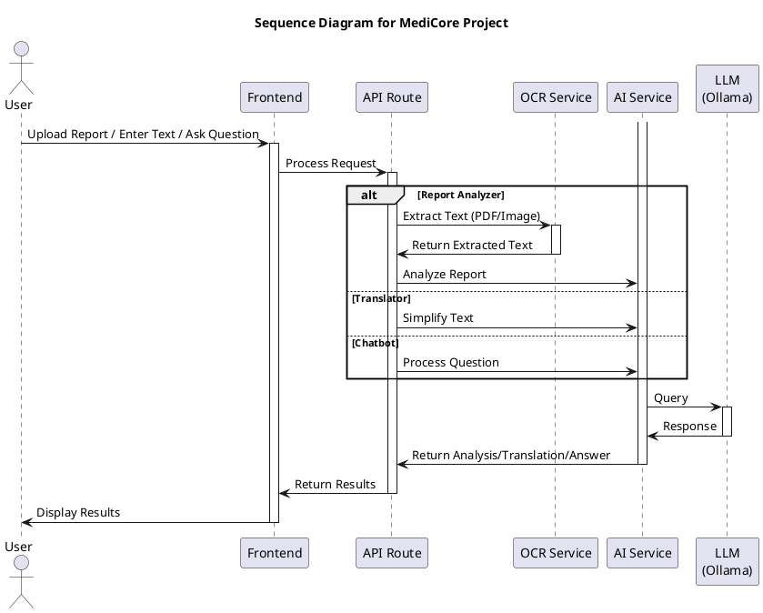

**For Mermaid:**

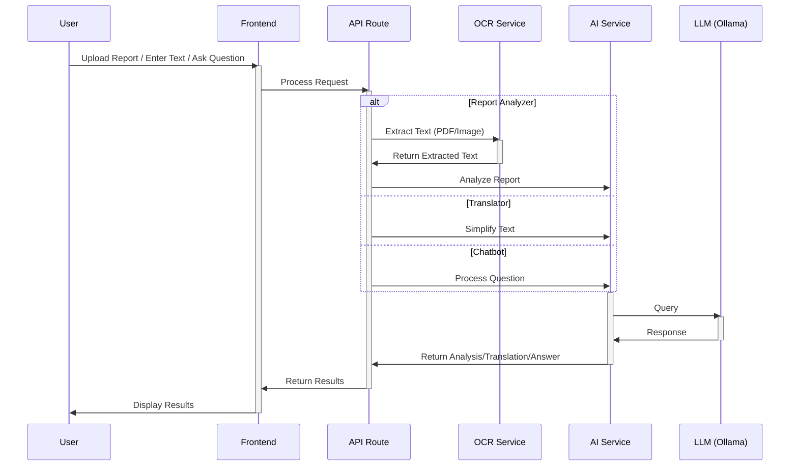

### **Even Simpler Version (Minimal):**

If you want an even more concise version:

**For SequenceDiagram.org:**

```
title Sequence Diagram for MediCore Project

User->Frontend: Upload Report / Enter Text / Ask Question
Frontend->API: Process Request

alt Report Analyzer
    API->OCR: Extract Text
    OCR->API: Extracted Text
end

API->AI: Analyze/Translate/Answer
AI->LLM: Query
LLM->AI: Response
AI->API: Results

API->Frontend: Return Results
Frontend->User: Display Results
```

This minimal version removes activation boxes and some details but shows the complete flow clearly.

### **Recommended: Use the First Version**
The first version (with activations and alt blocks) is recommended as it:
- Shows all three main features (Report Analyzer, Translator, Chatbot)
- Includes activation boxes for clarity
- Is still concise and not too big
- Follows the reference diagram style

